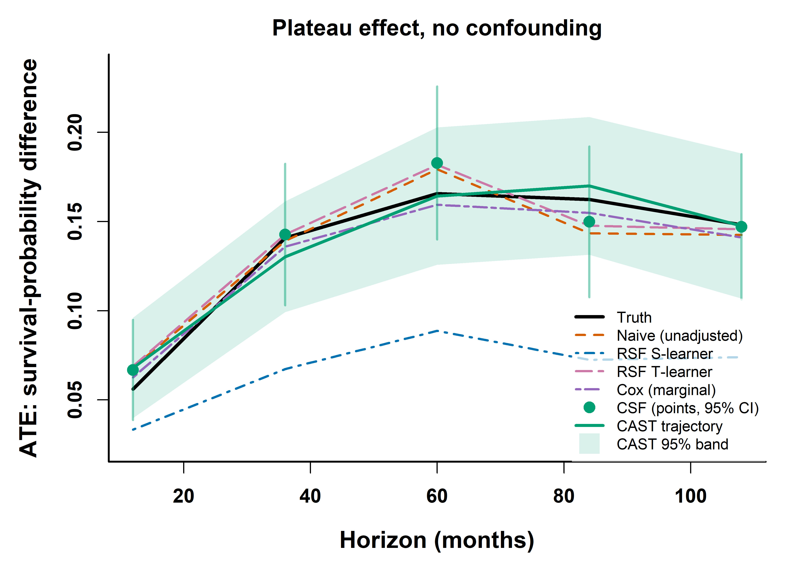
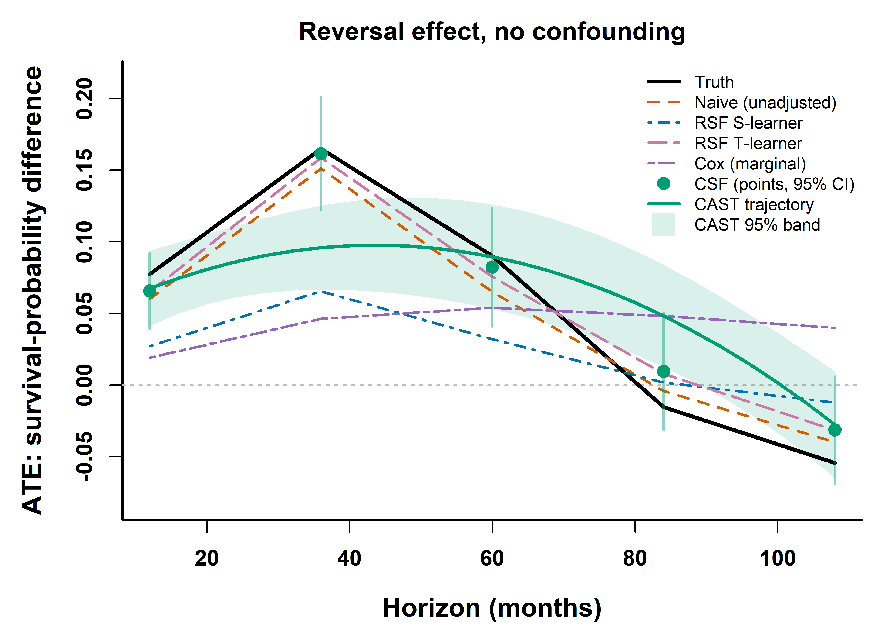
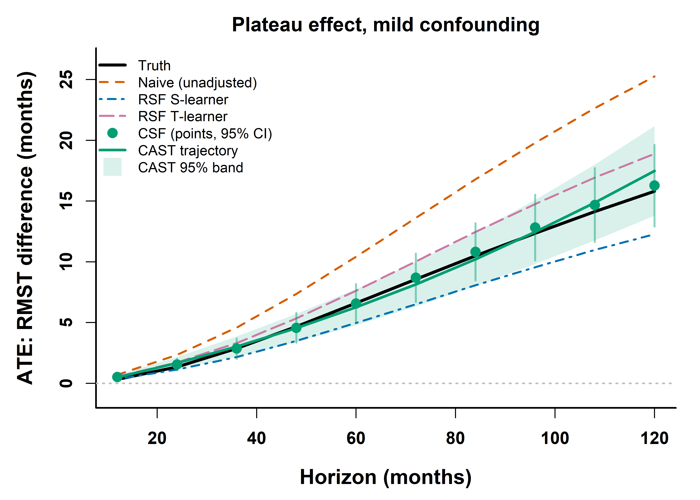
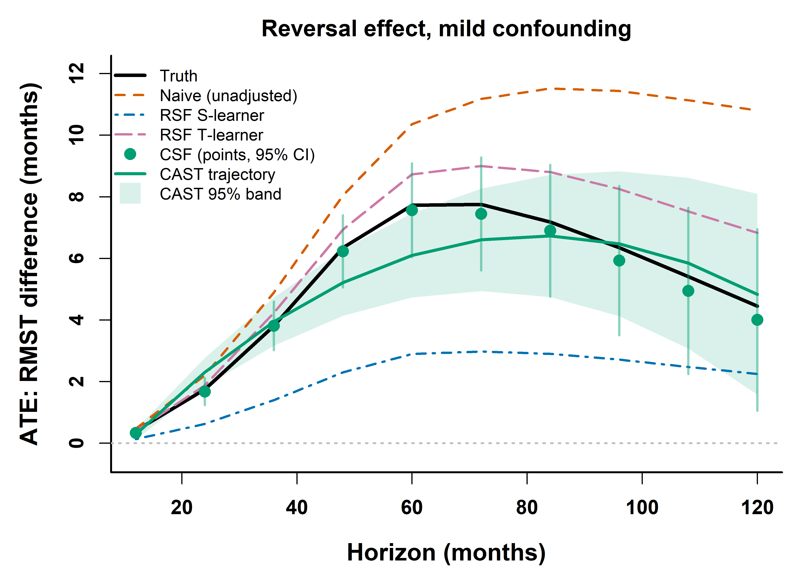
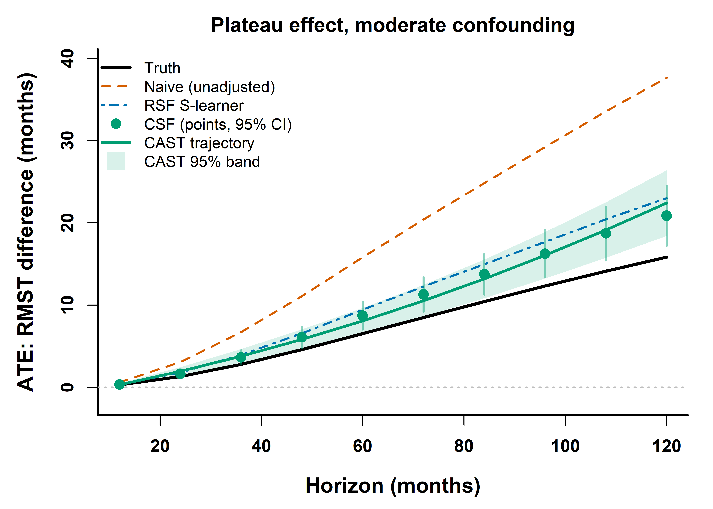
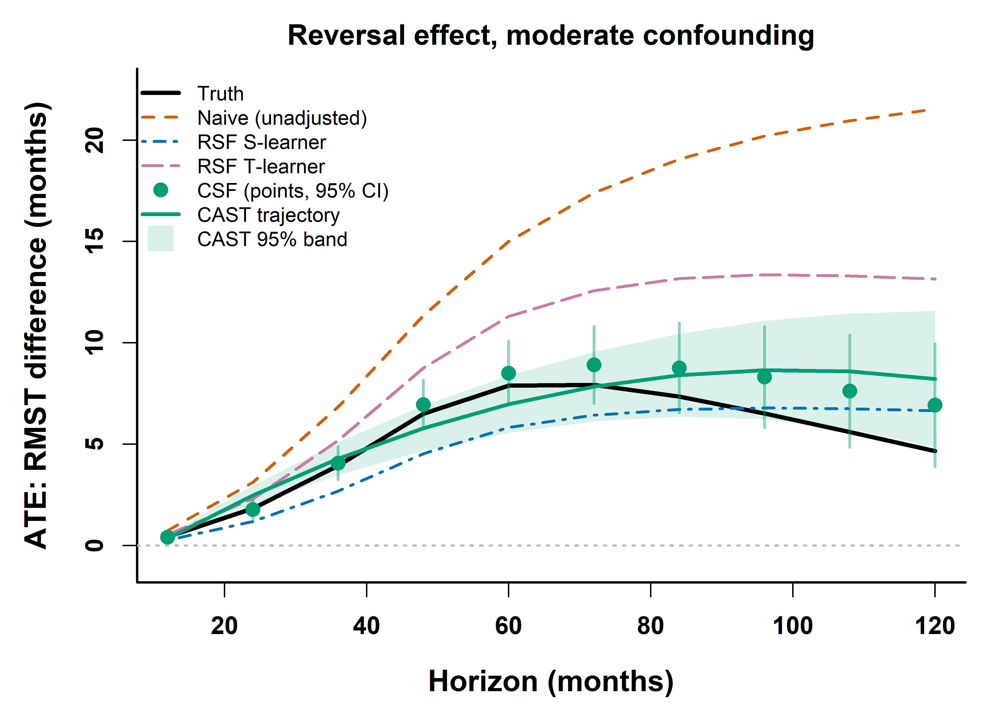
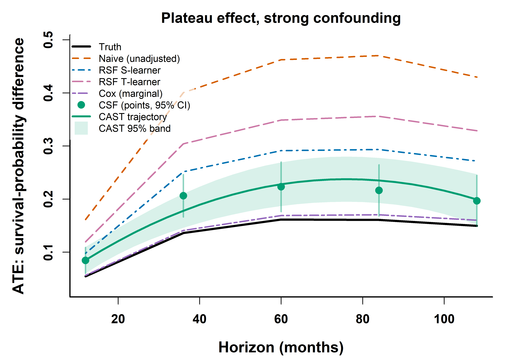
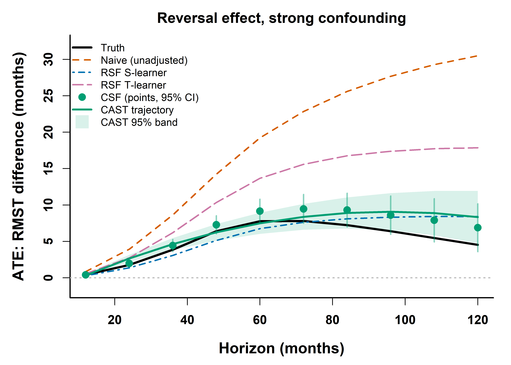
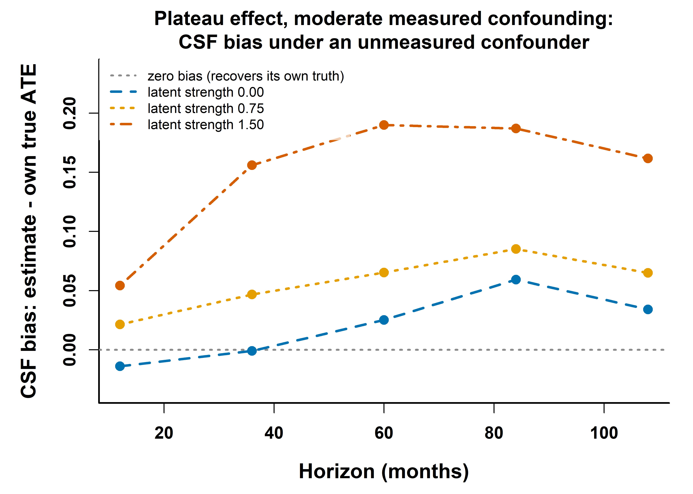

# CAST demo website: causal survival trajectories on simulated oncology data

An interactive teaching demo that shows, on **simulated** cancer-survival
cohorts where the true treatment effect is known:

1. how confounding by indication biases a **naive** unadjusted effect;
2. how a **Causal Survival Forest (CSF)** substantially reduces that
   confounding (with residual bias only when strong confounding pushes
   treatment propensities toward 0 or 1, a positivity/overlap limit);
3. which assumption each standard baseline needs, and the regime where each one
   breaks: **Cox** regression (correctly specified on the plateau shape, so it
   wins there, and unable to represent the reversal) and a **Random Survival
   Forest (RSF)** as both an S-learner and a T-learner (two different failure
   modes);
4. what an **unmeasured confounder** does to all of them at once, CSF and CAST
   included, while every visible diagnostic still looks healthy; and
5. how **CAST** extends CSF from per-horizon points to a smooth treatment-effect
   *trajectory* via the cross-horizon influence-function covariance, Ledoit–Wolf
   shrinkage, and a smooth quadratic fit with a covariance-aware band.

Because the data are simulated, every method is scored against the **known true
ATE(t)** (survival-probability-difference scale), the one comparison impossible
with real data.

## What you see

A plain-language **introduction** first, written for a reader who is not a
causal-inference specialist: what the demo is for, what data it is meant to
analyze and what it delivers, why the familiar tools (a direct comparison, a
single Cox hazard ratio, a survival-prediction model) fall short of the
question, what none of them can fix, and one line on each method drawn on the
figure. The formal statement of the estimand and the confounder taxonomy sit
one click below it, under *The simulated cohorts in detail*.

Then a single ATE-vs-horizon figure with two level selectors – **measured-confounding
strength** (γ, four levels) and **unmeasured-confounding strength** (Γ, three
levels) – an **effect-shape** selector, and per-method **toggles**, plus live
cards for
accuracy (RMSE vs. truth), the Cox hazard ratio and proportional-hazards test,
confounder imbalance (SMD, including the latent factor's own imbalance),
propensity overlap, the unmeasured-confounding oracle gap with its E-value, the
CAST trajectory summary, and the Ledoit–Wolf shrinkage intensity and covariance
condition number. Each card shows its live numbers on its face and opens its
bullets and full explanation when its title is clicked, so seven cards read as
seven headline numbers rather than seven essays.

The **effect-shape** selector switches between two trajectories: a **plateau**,
where treatment is protective throughout (constant hazard ratio ≈ 0.54), so on
the survival-probability scale the survival gap rises, peaks, then slowly narrows
as both arms approach low survival; and a **reversal**, where treatment helps
early (asymptotic HR ≈ 0.39) but harms late (asymptotic HR ≈ 2.05) through a
smooth transition around 48 months, so the survival curves cross and the
survival-probability difference rises, peaks, then turns negative. The reversal
is simulated like the plateau, drawn sharper than most real crossings, and
because it breaks
proportional hazards it is the case a single Cox hazard ratio cannot describe,
the motivation for a trajectory method.

## Preview

The static 600-DPI fallback figures the pipeline writes, one per confounding
level and effect shape (the live site is interactive: its measured-confounding
selector moves through these same panels). Each shows truth, Naive, RSF (S- and T-learner), the marginal
Cox curve, the CSF points with 95% CIs, and the CAST trajectory with its
covariance-aware 95% band. As confounding
rises the Naive curve diverges while CSF and CAST stay close to truth, with an
honest, growing residual bias at strong confounding.

| Confounding | Plateau effect | Reversal effect |
|:--|:--:|:--:|
| **None** (γ = 0) |  |  |
| **Mild** (γ = 0.5) |  |  |
| **Moderate** (γ = 1) |  |  |
| **Strong** (γ = 2) |  |  |

Every panel above is the Γ = 0 slice: no unmeasured confounder. The
unmeasured-confounding axis is the second selector on the live site, and the panel
below is its static summary. Measured confounding is held at γ = 1 while the
latent factor's strength rises, so the measured covariates stay balanced and the
overlap diagnostics stay clean while CSF drifts away from the truth anyway.

It plots the **bias**, CSF minus that scenario's *own* true ATE, rather than
three estimate curves against one truth line. The latent factor widens the
spread of baseline survival, so the true ATE is itself slightly different at
each Γ: on this panel (plateau, γ = 1) its peak falls from 0.163 at Γ = 0 to
0.140 at Γ = 1.5. Charging that shift to the estimator would overstate the
bias.



## Layout

```
cast_demo_website/
  R/
    cast_core.R          Ledoit–Wolf shrinkage, cross-horizon influence-function
                         covariance, covariance-aware quadratic trajectory fit,
                         true/KM survival-probability helpers (ported from the glioma CAST pipeline)
    01_simulate.R        simulate confounded cohorts + known true ATE(t)
    02_fit_methods.R     Naive / Cox / RSF S- and T-learner / CSF / CAST, plus the
                         oracle CSF refit and AUTOC, all scored vs truth
    03_export.R          write scenarios.json + PNG fallbacks
    04_replicate_seeds.R re-draw one scenario at N seeds; what replicates
    install_packages.R   one-time dependency install
  tests/
    run_tests.sh             one command; runs the eleven suites below
    test_data_contract.mjs   every field the site reads exists and lines up
    test_render_smoke.mjs    app.js actually runs at all 24 control settings
    test_export_labels.R     figure labels track gamma, not control position
    test_cast_core.R         golden values + invariants for the CAST math
    test_fit_contract.R      the oracle refit is a full oracle; E-value anchoring
    test_source_guards.R     the sourcing contract 04 reuses 01 and 02 through
    test_sim_provenance.R    every registered parameter still sits in the code
    test_style_contract.mjs  the CSS lets the markup take a size (bar fills)
    test_intro_contract.mjs  the page opens with something a non-specialist reads
    test_viewport_overflow.mjs the page fits a phone, measured in a real
                             viewport rather than read off a screenshot
  docs/                              <- the published static site (GitHub Pages root)
    index.html  app.js  style.css      static site (Plotly, no build step)
    data/scenarios.json                aggregate results (safe to publish)
    figs/*.png                         600-DPI fallback figures
  run_all.sh             orchestration (simulate -> fit -> export)
  sim_provenance.yaml    where every data-generating parameter came from
  constant_registry.yaml estimation-side constants, and what makes each still true
  audit_manifest.yaml    which auditors apply to this project, and why
  evidence_ledger.yaml   the two literature citations and their verification
  References/README.md   the same two sources, with licences (no PDFs committed)
  FIXES.md               landed fixes, with the evidence for each
  development/           the audits and decisions behind those fixes
  .github/workflows/     CI: the six node suites + a docs/ completeness check
  output/                R intermediates, output/preview/ for smoke-test exports,
                         and replicate_seeds.csv (all gitignored)
```

## Requirements

R 4.5.x with `grf`, `survival`, `jsonlite` (the RSF baseline uses
`grf::survival_forest`, so `randomForestSRC` is not needed). Install once:

```bash
Rscript R/install_packages.R
```

On Windows-R-from-WSL, point `RSCRIPT` at the Windows binary, e.g.
`"/mnt/c/Program Files/R/R-4.5.1/bin/x64/Rscript.exe" R/install_packages.R`.

**Versions that produced the shipped `docs/`.** R 4.5.1, `grf` 2.5.0, `survival`
3.8.3, `jsonlite` 2.0.0. `grf`'s forest internals change between releases, so a
different `grf` will reproduce the qualitative picture but not the exact
decimals in `scenarios.json`. `tests/test_cast_core.R` pins the parts of the
math that are pure R and must not move at all.

## Run

```bash
# full run (N=2000; 2 shapes x 4 measured x 3 unmeasured levels = 24 scenarios).
# Writes docs/data/scenarios.json and docs/figs/*.png. About 8 minutes with all
# forests tuned (measured: 7 min 32 s, R 4.5.1, 24 scenarios).
./run_all.sh

# fast smoke test (smaller N, fewer trees, reduced grid, no tuning).
# Writes output/preview/ and leaves docs/ untouched. Under a minute.
DEMO_SUBSAMPLE=600 ./run_all.sh
```

A subsample run deliberately reduces the grid to one effect shape, two
confounding levels and no latent-confounder axis. Exporting that into `docs/`
would replace the published site data with a smoke-test artifact, so it goes to
`output/preview/` instead; only a full run touches `docs/`.

`run_all.sh` prefers `$RSCRIPT`, then Windows R 4.5.1 (when run from WSL), then
`Rscript` on `PATH`. Env vars cross the WSL→Windows boundary through `WSLENV`
(already set in the script). Tunables: `DEMO_SUBSAMPLE` (cohort size; 0 = full),
`DEMO_NUM_TREES`, `DEMO_SEED` (forest seed; default 101, so the exported
`scenarios.json` is reproducible across runs), and `DEMO_TUNE` (hyperparameter
tuning; default `all` for a full run, `none` for the smoke test).

**Hyperparameter tuning.** On a full run all forests are tuned, which is slower
but more accurate. The propensity (`grf::regression_forest`) and CSF
(`grf::causal_survival_forest`) use grf's built-in `tune.parameters = "all"`
cross-validation over `sample.fraction`, `mtry`, `min.node.size`, the honesty
fractions, `alpha`, and `imbalance.penalty`. The RSF (`grf::survival_forest`,
which has no built-in tuner) is tuned with a small grid over `min.node.size`
∈ {5, 15, 50}, `sample.fraction` ∈ {0.35, 0.5}, and `mtry`, selected by
out-of-bag concordance at a mid-window horizon. Set `DEMO_TUNE=none` to skip
tuning for a fast check.

## View the site locally

`fetch()` needs http (not `file://`), so serve the `docs/` folder:

```bash
cd docs && python3 -m http.server 8000   # open http://localhost:8000
```

## Publish on GitHub Pages

The site lives in `docs/`, which GitHub Pages can serve directly:

1. Push this repo to GitHub.
2. Repo **Settings → Pages**.
3. Under **Build and deployment**, set **Source = Deploy from a branch**, then
   **Branch = `main`** and **Folder = `/docs`**, and **Save**.
4. After a minute the site is live at
   `https://ishuryak.github.io/cast_demo_website/`
   (or `https://<your-username>.github.io/<repo-name>/` for a fork).

Only aggregate artifacts ship. The per-patient simulated intermediates in
`output/` are gitignored.

## For collaborators

### Pipeline (what each script produces)

`run_all.sh` runs three R scripts in order:

1. **`R/01_simulate.R`** → `output/sim.rds`. Simulates the confounded cohorts and
   the *known* true ATE(t). One entry per scenario, each holding the per-patient
   rows and the oracle effect curve.
2. **`R/02_fit_methods.R`** → `output/fits.rds`. Fits Naive / Cox / RSF S-learner /
   RSF T-learner / CSF / CAST on each cohort and scores every method against the
   truth.
3. **`R/03_export.R`** → `docs/data/scenarios.json` + `docs/figs/*.png`. Writes
   the aggregate results the website reads, plus the 600-DPI fallback figures.

`R/cast_core.R` holds the shared CAST routines (Ledoit–Wolf shrinkage, the
cross-horizon influence-function covariance, the covariance-aware quadratic
trajectory fit, and the true/KM survival-probability helpers).

### Data-generating model

Everything is generated from a known model, so **no patient data are used
anywhere**. Each scenario (one effect shape × one measured-confounding level γ ×
one unmeasured-confounding level Γ) simulates **n = 2000** independent
patients. The covariates fall into three roles:

- **Confounders** (affect both prognosis and treatment assignment): age, stage,
  performance status, comorbidity count.
- **Prognostic non-confounder** (affects survival only): smoking. It shortens
  survival but does not affect who is treated and does not modify the effect.
- **Negative controls** (affect nothing): sex and ethnicity. Included so the
  methods can be seen to correctly ignore irrelevant covariates.
- **Unmeasured confounder** (affects both, and is never given to any model): a
  standardized latent "fitness" factor. It is simulated into the cohort, drives
  both baseline survival and treatment assignment, and is then withheld from
  every fitted model. Its strength is the second axis of the scenario grid.

Every formula below is exactly what `R/01_simulate.R` implements.

**1. Covariate distributions** (drawn independently per patient):

$$
\text{age}\sim\mathcal N(60,10^2),\quad
\text{stage}\sim\text{Cat}(\lbrace 1,2,3,4\rbrace;0.25,0.30,0.25,0.20),
$$
$$
\text{ps}\sim\mathrm{clip}\big(\mathcal N(80,12^2),40,100\big),\quad
\text{comorb}\sim\min\big(\mathrm{Pois}(1),4\big),
$$
$$
\text{smoke}\sim\mathrm{Bern}(0.45),\quad
\text{sex}\sim\mathrm{Bern}(0.5),\quad
\text{eth}\sim\text{Cat}(\lbrace A,B,C\rbrace;0.5,0.3,0.2),\quad
U\sim\mathcal N(0,1).
$$

$U$ is the **latent (unmeasured) confounder**. It is generated here, enters both
linear predictors below, and is never passed to any fitted model.

Confounders are standardized for use in the linear predictors:
$z_{\text{age}}=(\text{age}-60)/10$, $z_{\text{stage}}=(\text{stage}-2.5)/1.1$,
$z_{\text{ps}}=(\text{ps}-80)/12$, $z_{\text{com}}=(\text{comorb}-1)/1$.

**2. Baseline (control) survival** is Weibull with shape $k=1.4$. The control
log-scale predictor and Weibull scale are

$$
\eta^{\text{surv}}=-0.25z_{\text{age}}-0.45z_{\text{stage}}+0.30z_{\text{ps}}-0.30z_{\text{com}}-0.40\text{smoke}+0.45\Gamma U,
\qquad
\lambda_0=\exp(4.3+\eta^{\text{surv}}),
$$

giving the per-patient baseline hazard
$h_0(u)=\dfrac{k}{\lambda_0}\left(\dfrac{u}{\lambda_0}\right)^{k-1}$
where $\Gamma=$ `unmeas_strength` $\in\lbrace 0,0.75,1.5\rbrace$ is the
unmeasured-confounding knob. The **marginal control-arm median survival is
about 47 months** (the value a Kaplan–Meier curve of the control arm shows;
$e^{4.3}(\ln 2)^{1/k}=56.7$ is the median at $\eta^{\text{surv}}=0$ only, and
the cohort mean of $\eta^{\text{surv}}$ is about $-0.14$, mostly the smoking
term). Smoking lowers $\eta^{\text{surv}}$, so smokers do worse; sex and
ethnicity have zero coefficients.

**3. Treatment effect** is a time-varying hazard ratio that depends on the shape
and time only (never on covariates). The reversal transitions smoothly (logistic,
width $s_w=12$ months) around $u^{*}=48$ months rather than stepping, so the
survival-probability truth is differentiable and a smooth quadratic trajectory is
a fair model:

$$
\text{plateau:}\ \ \mathrm{HR}(u)=e^{-0.62}\approx0.54;\qquad
\text{reversal:}\ \ \mathrm{HR}(u)=\exp\left\lbrace -0.95+1.67\sigma\left((u-48)/12\right)\right\rbrace,
$$

where $\sigma$ is the logistic function, so $\mathrm{HR}\to e^{-0.95}\approx0.39$
early and $\to e^{0.72}\approx2.05$ late. The treated hazard is
$h_1(u)=h_0(u)\mathrm{HR}(u)$.

**4. Potential-outcome survival curves** for arm $w\in\lbrace 0,1\rbrace$ on a fine grid
($u\in[0,210]$, step 0.5 months) are

$$
H_w(t)=\int_0^t h_w(u)du,\qquad S_w(t)=\exp\lbrace -H_w(t)\rbrace
$$

(the integral is accumulated as a left-endpoint Riemann sum over the grid,
`cumsum(h * du)` with `du = c(0, diff(grid))`; at a 0.5-month step the
difference from a trapezoidal rule is far below the Monte-Carlo noise).

**5. Treatment assignment** (the confounding knob, $\gamma=$ `conf_strength`
$\in\lbrace 0,0.5,1,2\rbrace$). Only the confounders enter the propensity:

$$
\eta^{\text{treat}}=\gamma(-0.5z_{\text{age}}-0.6z_{\text{stage}}+0.5z_{\text{ps}}-0.45z_{\text{com}})+0.60\Gamma U,
\qquad
\pi=\frac{1}{1+e^{-\eta^{\text{treat}}}},\qquad W\sim\mathrm{Bern}(\pi).
$$

At $\gamma=0$ assignment is random (a clean trial); as $\gamma$ rises, healthier
patients (younger, earlier-stage, better performance status, fewer
comorbidities) are preferentially treated, i.e. confounding by indication.
Smoking, sex, and ethnicity do **not** enter $\pi$. Treatment is **binary**.

$U$ enters *both* $\eta^{\text{surv}}$ and $\eta^{\text{treat}}$, so it is a
confounder in the strict sense, and at $\Gamma>0$ it confounds even when
$\gamma=0$: assignment is no longer random, but nothing in the observed
covariates records it. This is what the second selector sets. Every fitted
model in `R/02_fit_methods.R` sees only (age, stage, performance status,
comorbidity, smoking, sex, ethnicity); $U$ is passed to exactly one place, the
deliberately labelled **oracle** CSF refit, whose only purpose is to measure
what omitting it costs. That refit gets $U$ on **both** sides: added to the
covariate matrix *and* to the propensity forest that supplies `W.hat`. Both are
required, because $U$ enters $\eta^{\text{treat}}$ as well as
$\eta^{\text{surv}}$: an oracle given $U$ only in the outcome model leaves the
orthogonalization misspecified on the treatment side (see `FIXES.md`).

Read the resulting gap as **a component of CSF's error, not all of it**. The
oracle does not land on the truth at strong measured confounding, because CSF
also carries a positivity residual there that is present already at $\Gamma=0$
and is nothing to do with $U$. Measured on the shipped grid at the 60-month
horizon: at $\Gamma=1.5$ the oracle removes 39–95% of the total error depending
on the panel, and at $\Gamma=0.75$ the latent factor's contribution is small
enough that the gap is comparable to between-seed noise.

**6. Observed data.** The latent event time is drawn by inverse-CDF from the
*assigned* arm's curve, $T=S_W^{-1}(U)$ with $U\sim\mathrm{Unif}(0,1)$
(implemented via $F_W=1-S_W$). Censoring is non-informative random
loss-to-follow-up (exponential dropout that can occur at any time from study
entry, independent of $T$, $W$, and the covariates), capped by administrative
censoring at 180 months:

$$
C=\min\big(\mathrm{Exp}(1/210),180\big),\qquad
Y=\min(T,C),\qquad D=\mathbf 1\lbrace T\le C\rbrace.
$$

The exponential mean (210 months) is calibrated so the overall censoring rate is
about 30% (event rate ≈ 70%), spread throughout follow-up rather than
concentrated at the administrative cap. Censoring is independent of survival, so
it remains non-informative and the causal identification is unaffected.

**7. Estimand and oracle truth.** The target is the survival-probability
difference at horizon $t$. With the known potential-outcome curves,

$$
\mathrm{ATE}(t)=\frac1n\sum_{i=1}^n\big[S_{1}(t\mid i)-S_{0}(t\mid i)\big],
$$

evaluated at $t\in\lbrace 12,36,60,84,108\rbrace$ months. Because $S_0,S_1$ are known, this
truth is exact. Sex and ethnicity (zero coefficients) and smoking (enters only
$\eta^{\text{surv}}$, identically in both arms) never change the true ATE; it is
driven by the covariates' effect on baseline survival and by $\mathrm{HR}(u)$.
The latent factor $U$ is one of those covariates, so at $\Gamma>0$ it spreads
baseline survival wider and the true ATE curve shifts slightly: across the 24
scenarios the peak true ATE runs 0.161–0.165 at Γ = 0 and 0.136–0.148 at
Γ = 1.5 (the spread within each Γ is Monte-Carlo variation between cohort
seeds). The truth is recomputed per scenario from that
scenario's own $S_0,S_1$, so every method is always scored against the truth of
the cohort it was actually fit on.

This produces **24 scenarios** (2 effect shapes × 4 measured-confounding
levels $\gamma\in\lbrace 0,0.5,1,2\rbrace$ × 3 unmeasured-confounding levels
$\Gamma\in\lbrace 0,0.75,1.5\rbrace$), each at 5 horizons (12–108 months, spaced
24 months apart, wide enough that the cross-horizon influence-function covariance
is well-conditioned and the trajectory fit uses generalized least squares). All
24 are reachable from the live site's two selectors. The 8 static preview figures
are the $\Gamma=0$ slice, plus one figure for the unmeasured axis.

### Data tiers

- **Intermediates (gitignored, not in the repo):** `output/sim.rds`,
  `output/fits.rds` hold the per-patient simulated rows (age, stage, performance
  status, comorbidity, smoking, sex, ethnicity, the latent factor `u_hidden`,
  treatment `W`, observed time `Y`, event `D`), the true ATE curves, and the
  fitted results. `output/preview/` holds smoke-test exports. Kept out of git on
  principle (row-per-patient layout); regenerate them by running the pipeline.
- **Published data (the only data in the repo):** `docs/data/scenarios.json`
  (about 75 KB for the 24-scenario grid) is fully **aggregate**: per scenario it
  stores cohort metadata (shape, both confounding strengths, n, event rate,
  treated fraction, SMDs including the latent factor's), the truth / Naive / RSF
  S- and T-learner ATE vectors, the CSF points with CIs, the CAST trajectory with
  its band, peak metrics and a dense quadratic curve for smooth rendering, the
  Cox HR + PH-test p-value and marginal survival-probability curve, the
  propensity-overlap diagnostics, the unmeasured-confounding robustness block
  (CSF with and without the latent factor, their difference, the control-arm
  survival each horizon's E-value is anchored to, and that E-value), an
  AUTOC benefit-ranking statistic, the Ledoit–Wolf shrinkage diagnostics, and
  each method's RMSE vs. truth. No patient-level rows.
  Because the cohorts are synthetic, nothing sensitive exists even in the
  gitignored intermediates. Parameter provenance for every constant in the
  data-generating model is recorded in `sim_provenance.yaml`.

### Regenerate

```bash
./run_all.sh                       # full run, regenerates scenarios.json + figures
DEMO_SUBSAMPLE=600 ./run_all.sh    # fast smoke test -> output/preview/
```

### Replication

Every panel on the site is a single cohort at a single seed, which is enough for
a teaching figure and not enough to tell a real difference between two methods
from a lucky draw. This re-draws one scenario at several independent cohort
seeds, refits every method, and reports the between-seed spread and each
method's rank in each draw:

```bash
Rscript R/04_replicate_seeds.R                       # 5 seeds, plateau, gamma = 1
DEMO_REPLICATE_SEEDS=3 Rscript R/04_replicate_seeds.R
DEMO_REPLICATE_SHAPE=reversal Rscript R/04_replicate_seeds.R
```

It writes `output/replicate_seeds.csv` (one row per seed x method) and prints the
summary table. It reuses the pipeline's own `simulate_cohort()` and
`fit_scenario()` rather than restating them, so a change to a method changes the
replication in the same commit; the sourcing contract that makes that safe is
pinned by `tests/test_source_guards.R`. Replication seeds start at 2001, clear of
the published grid's 1001-1024, so it never replicates a panel against itself.
It writes nothing into `docs/` and does not touch `output/sim.rds` or
`output/fits.rds`.

This is where the two replication claims in [How to read the results
honestly](#how-to-read-the-results-honestly) come from. On the shipped defaults
(plateau, γ = 1, Γ = 0, n = 2000, 5 seeds, all forests tuned):

| | Naive | Cox | RSF-S | RSF-T | CSF | CAST |
|---|---|---|---|---|---|---|
| mean RMSE | 0.180 | **0.005** | 0.045 | 0.097 | 0.035 | 0.034 |
| sd | 0.018 | 0.004 | 0.010 | 0.012 | 0.010 | 0.011 |
| rank per seed | 6,6,6,6,6 | 1,1,1,1,1 | 4,4,4,4,4 | 5,5,5,5,5 | 3,3,2,3,3 | 2,2,3,2,2 |

Naive, Cox and both RSF learners hold one rank in all five draws; CSF and CAST
swap. Different `grf` versions will move the decimals (see Requirements), so
re-run it rather than trusting this table if the numbers matter to you.

### Tests

```bash
./tests/run_tests.sh
```

Eleven suites, all runnable without a full pipeline run (pass a different
`scenarios.json` as the first argument to check another export, e.g.
`./tests/run_tests.sh output/preview/data/scenarios.json` after a smoke test):

- **`test_data_contract.mjs`** (node) checks that `docs/data/scenarios.json`
  satisfies everything `docs/app.js` reads: every (shape – measured level –
  unmeasured level) combination the selectors can reach resolves to a scenario,
  every vector matches the horizon count, and every card field is present. This
  is the check that catches a front end and an export that have drifted apart,
  which is exactly how the site broke once before.
- **`test_render_smoke.mjs`** (node) goes further and actually *runs* `app.js`
  against the data in a minimal DOM, driving all 24 control settings and
  asserting that each one draws a plot with all seven method traces and fills
  every card. The contract test proves the fields exist; this proves the code
  that consumes them works.
- **`test_style_contract.mjs`** (node) checks that anything the page sizes with a
  percentage also declares a display that can take a size. It exists because the
  RMSE bar fills were emitted correctly and styled correctly and still rendered
  as empty grey rails: they were inline spans, and an inline non-replaced element
  ignores `width` and `height`. Every other suite passed throughout, because the
  markup was never the problem.
- **`test_intro_contract.mjs`** (node) checks that the page still opens with an
  introduction a non-specialist can read: that it comes before the controls,
  that it answers the goal / data-and-deliverable / what-the-familiar-tools-miss
  / what-nothing-fixes questions, that every method drawn by `app.js` has a line
  in it (a method added to the figure with no introduction line fails here),
  that it stays inside a word cap, and that a blocklist of specialist terms
  stays out of it. It exists because every other suite passed on a page whose
  first words were "the estimand is the RMST difference": correctness and
  legibility are different properties, and only one of them had a test.
- **`test_viewport_overflow.mjs`** (node) loads the published page in an iframe of
  each width and asks the page for its own geometry: no element's right edge may
  pass the viewport's, and `scrollWidth` must equal `clientWidth`, at 360, 420,
  620, 720, 1024 and 1440 px. It replaces a headless *screenshot* check, which is
  not a measurement of layout: Chrome will not open a window narrower than about
  500 px, so a 420 px screenshot lays the page out at ~497 px and crops the
  image, which looks exactly like an overflow. Reading that crop is how this
  repository briefly recorded a mobile-overflow defect that was never in the
  stylesheet. Because the suite asserts an *absence*, it carries a negative
  control and runs it every time: a second iframe loads the same page with one
  deliberately 1600 px-wide element appended, and the suite fails if that does
  not report an overflow. It needs a Chrome or Edge and skips, rather than fails,
  without one.
- **`test_export_labels.R`** checks that a confounding-strength label is derived
  from the value of γ, never from a position in the grid, so a change to
  `CONF_GRID` cannot silently retitle a figure.
- **`test_cast_core.R`** pins the CAST math: Ledoit–Wolf shrinkage bounds and the
  known-answer case, the sandwich variance collapsing to $(X^{\top}\Sigma^{-1}X)^{-1}$
  under GLS, the quadratic vertex, the oracle survival-probability ATE, and
  golden values that must not move when a dependency is upgraded.
- **`test_fit_contract.R`** pins two properties of the estimation code that are
  invisible in its output: that the oracle CSF refit receives an oracle
  *propensity* and not the blinded one, and that the E-value's risk-ratio
  conversion is anchored to the control-arm survival at each horizon rather than
  to a fixed baseline. Both regressions produced entirely plausible numbers, so
  they are pinned at the source level rather than by eyeballing an estimate.
- **`test_source_guards.R`** pins the `DEMO_SOURCE_ONLY` contract that lets
  `R/04_replicate_seeds.R` reuse the pipeline's own `simulate_cohort()` and
  `fit_scenario()` instead of restating them. The guard has two failure modes,
  both silent: too wide and `Rscript R/02_fit_methods.R` fits nothing while
  exiting 0, leaving the site to be rebuilt from stale results; too narrow and
  running the replication overwrites the published grid's fitted results.
- **`test_sim_provenance.R`** checks that `sim_provenance.yaml` still describes
  `R/01_simulate.R`. Each of the 54 registered values carries a regex matching
  the exact construct it comes from, value included, which must match exactly
  once, not a search for the number anywhere in the file, because 41 of the 56
  values appear more than once (0.45 is a smoking prevalence *and* two different
  coefficients), so a file-wide search passes while the code says something else.

Every one of these was confirmed to fail against the defect it guards before
being accepted; see `FIXES.md`.

Note for contributors: this repository is developed on a Windows drive under
WSL, where `core.fileMode` is `false`, so **`git add` will not record a new
script's executable bit**. After adding an executable script, run
`git update-index --chmod=+x <path>` or it will be unrunnable in a fresh clone.

### How to read the results honestly

The demo is built to be looked at critically, so five things are worth stating
plainly rather than leaving for a reader to discover. The first two are
measurements, not impressions: `R/04_replicate_seeds.R` re-draws a scenario at
five independent cohort seeds and prints the table they come from, so both can
be checked rather than taken on trust (see [Replication](#replication)).

1. **Each panel is one cohort at one seed.** Across five independent draws of
   the plateau, γ = 1 cohort, the between-seed standard deviation of a method's
   RMSE is up to 0.018, and the full spread up to 0.043, larger than several of
   the gaps the RMSE card shows. The coarse ordering survives replication: Naive
   is worst and Cox best in 5 of 5 draws, and the two RSF learners hold fourth
   and fifth in 5 of 5. The fine ordering does not: CSF and CAST differ by 0.001
   on a spread of about 0.02 and swap rank between draws. Read the ordering, not
   the third decimal.
2. **Cox is not a straw man here; on the plateau it is the true model.** The
   simulation generates survival from a proportional-hazards Weibull with linear
   covariate effects, which is precisely what the Cox model assumes, so on the
   plateau shape Cox is correctly specified and is the most accurate method in
   all five draws (mean RMSE 0.005 versus 0.035 for CSF at γ = 1). Its failure
   is confined to the reversal, where a single hazard ratio cannot represent a
   crossing effect. A demo that showed only the reversal would be flattering CSF
   by choice of scenario.
3. **The Ledoit–Wolf shrinkage step is near-inert at this size.** With n = 2000
   and only 5 horizons the sample cross-horizon covariance is already
   well-conditioned, so the shrinkage intensity is a few thousandths and the
   condition number barely moves. The step matters in the production pipeline
   (more horizons, smaller cohorts, the near-collinear cumulative-RMST scale);
   here it is shown running, not shown mattering.
4. **CSF and CAST are scored in-sample**, with no train/test split, so their
   accuracy is optimistic relative to deployment.
5. **The γ = 0 panels are a single draw too, and the plateau one is unlucky.**
   The site opens on plateau, γ = 0, Γ = 0, where treatment is assigned at
   random and the story says the naive estimate should match the truth. On this
   particular cohort it does not: at 36 months the naive, T-learner and CSF
   estimates all sit near 0.19 against a true 0.14, and the CSF 95% interval
   excludes the truth at that one horizon. This is not confounding and not a
   bug. With random assignment all three estimate the same quantity from the
   same empirical survival curves, so they share one draw's fluctuation, and Cox
   (correctly specified here) lands on the truth. Over the Γ = 0 panels with
   γ ≤ 1 the CSF interval covers the truth at 28 of 30 horizons, which is what
   nominal coverage looks like. Read the γ = 0 panel as one draw, not as a
   calibration check.

A full run prints several dozen warnings of the form *"estimated treatment
propensities take values very close to 0 or 1"*. These come from `grf` and are
expected: they fire on the strong-confounding scenarios and are the same
positivity stress the overlap card reports. They are left visible rather than
suppressed.

## Method provenance

CAST was developed by Yang et al. (see [Citation](#citation)). This repository
demonstrates that method on simulated data and is not the analysis code for
either paper. `R/cast_core.R` is ported from the production pipeline used in the
lower-grade glioma study.

The CSF fits use `grf::causal_survival_forest` (survival.probability target,
propensity from a `grf::regression_forest`). The CAST layer builds the
cross-horizon covariance from the CSF doubly-robust influence-function scores
(`get_scores()`; the covariance of the ATE vector is `cov(Ψ)/n`), stabilizes it
with `ledoit_wolf_shrinkage()`, and fits a smooth quadratic in time. The point
estimate is generalized least squares `β̂ = (XᵀΣ̂⁻¹X)⁻¹XᵀΣ̂⁻¹y`, used
automatically when two conditions both hold: Σ̂ is well-conditioned
(condition number ≤ 100) and the resulting quadratic explains at least half the
variation across horizons (R² ≥ 0.5, so a well-conditioned but badly fitting GLS
solution is not preferred to WLS). On the survival-probability scale both hold
in all 24 scenarios; it falls back to weighted least squares when Σ̂ is
ill-conditioned, as on the cumulative-RMST scale. Both thresholds are registered
in `constant_registry.yaml`.
The 95% band is the covariance-aware sandwich
`Var(β̂) = (XᵀWX)⁻¹ XᵀWΣ̂WX (XᵀWX)⁻¹`, so the shrunk cross-horizon covariance
propagates into the uncertainty rather than treating horizons as independent.

## Data note

All cohorts are simulated from a known generative model. **No patient data** are
used or distributed.

## Citation

If you use CAST, please cite the methods paper:

Yang, E., Vasishtha, R., Dad, L. K., Kachnic, L. A., Hope, A., Wang, E., Wu, X.,
Yuan, Y., Brenner, D. J., & Shuryak, I. (2025). *CAST: Time-Varying Treatment
Effects with Application to Chemotherapy and Radiotherapy on Head and Neck
Squamous Cell Carcinoma*. arXiv:2505.06367.
https://arxiv.org/abs/2505.06367

The applied study whose pipeline `R/cast_core.R` is ported from:

Yang, E., Agrawal, S., Kinslow, C. J., Cheng, S. K., Yang, L., Wang, E.,
Wang, T. J., Kachnic, L. A., Brenner, D. J., & Shuryak, I. (2026). Estimating
temporal treatment-effect patterns of radiotherapy and chemotherapy in
lower-grade gliomas using causal machine learning. *Scientific Reports*,
16, 23659. https://doi.org/10.1038/s41598-026-54656-0

To cite this demonstration site specifically, cite the methods paper above and
link to this repository.

## Changes

`FIXES.md` records every landed fix with the symptom, the evidence it was real,
the test that now pins it, and whether it moved any published number.
`development/` holds the audits and decisions behind them.

## License

The code in this repository is [MIT](LICENSE) © 2026 Igor Shuryak. The CAST
method itself is the work of Yang et al. as cited above, and the MIT license
covers this implementation rather than any claim over the method.
